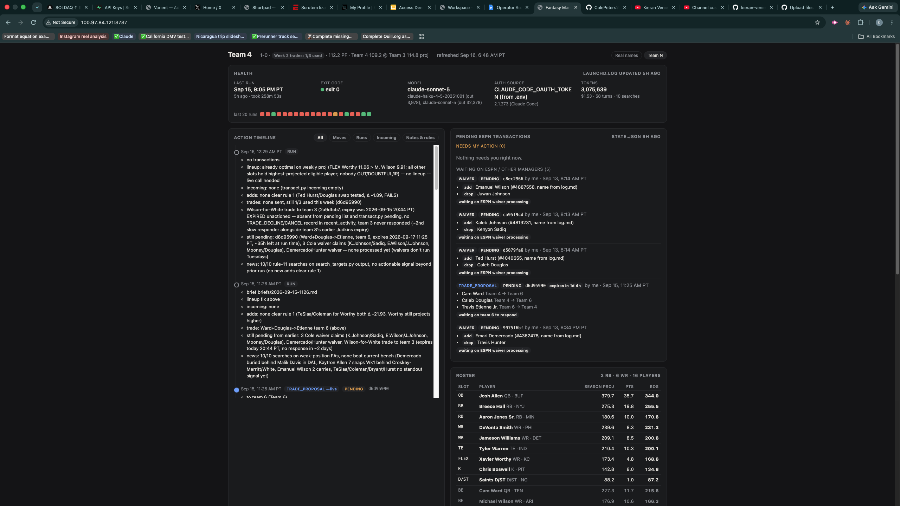

# fantasy-bot

**An AI that runs my ESPN fantasy football team completely on its own.**
It sets my lineup, claims players off waivers, and proposes, accepts, and declines trades — every day, on a schedule, on a Mac mini in my room. I don't touch it.



▶ **Watch me build it:** [link coming]

---

## What it actually does

Every scheduled run, the bot:

1. **Reads the whole league** from ESPN — my roster, all 16 teams, free agents, pending transactions.
2. **Checks the news** — web-searches any of my players flagged questionable/out, plus the top free agents at my weakest positions.
3. **Sets my optimal lineup** and executes the change.
4. **Evaluates waivers and trades** against a written rulebook, and acts within its permissions.
5. **Writes a plain-English brief** explaining every decision — including the ones I might disagree with.

It runs itself. A human only steps in for the moves the rulebook deliberately holds back (see Permissions below).

## What makes this interesting

- **It has a rulebook, not just prompts.** A `CLAUDE.md` file defines how the bot values players, when it may trade, and what it must never do. Every run reads it first.
- **Permission gates.** Actions are split three ways — **Auto** (lineups, waiver claims, drafting), **Ask** (anything that spends a roster slot or sends an offer waits for me), **Never** (nothing outside its defined scope). This is what makes handing a bot real control safe.
- **It talks to ESPN's *undocumented* write API.** ESPN has no official public API for making transactions. The bot builds the exact request packets ESPN's own website sends, and defaults every action to a dry run until proven.
- **It reasons with a real model on a schedule.** Runs headless via `launchd`, authenticated with a long-lived token, so it survives reboots and never needs me at the keyboard.

## How it's built

| File | Role |
|------|------|
| `league_state.py` | **The scout.** Pulls the full league from ESPN into clean JSON. |
| `transact.py` | **The hands.** Executes lineup changes, waivers, and trades. Dry-run by default. |
| `search_targets.py` | Decides which players are worth a news search, to keep runs cheap. |
| `run.sh` / `run-prompt.md` | The scheduled runner and the instructions the model follows each run. |
| `CLAUDE.md` | The rulebook and season-long memory. |
| `dashboard/` | A local web dashboard showing every decision, the roster, and health. |

## Setup

You'll need: an ESPN fantasy account, Python 3, and (for scheduled runs) Claude Code.

**1. Clone and install:**

```bash
git clone https://github.com/kieran-venieris/fantasy-bot.git
cd fantasy-bot
pip3 install espn_api --break-system-packages
```

**2. Copy the env template and fill it in:**

```bash
cp .env.example .env
```

You'll need your `ESPN_S2` and `SWID` cookies (from your browser while logged into ESPN), plus your `LEAGUE_ID` and `TEAM_ID` (from your league and team URLs). For scheduled runs, add a `CLAUDE_CODE_OAUTH_TOKEN` — generate one with `claude setup-token`.

**3. Pull the current league state:**

```bash
set -a; source .env; set +a
python3 league_state.py > state.json
```

**4. Test a transaction in dry-run** (nothing is sent to ESPN without `--live`):

```bash
python3 transact.py add --add "Player Name" --drop "Bench Player"
```

**5. Run the dashboard** (optional):

```bash
python3 dashboard/server.py
```

Then open `http://localhost:8787`.

Scheduling the full autonomous run is done through `run.sh` plus a `launchd` job — see `implementation-notes.md` for the exact setup.

## Permissions

| Level | What the bot may do |
|-------|--------------------|
| **Auto** | Read the league, set the optimal lineup, submit waiver claims, draft moves. |
| **Ask** | Send a trade offer, accept an incoming trade, drop a starter — surfaced to me first. |
| **Never** | Anything outside a defined module, delete anything, handle credentials. |

## Limitations & disclaimer

- **Not affiliated with ESPN.** This uses ESPN's private, undocumented endpoints, which can change or break without notice.
- **Use at your own risk.** It makes real transactions on your real team. Test in dry-run first, and always read what it's doing.
- **Projections drive decisions.** The bot is only as good as ESPN's projections and the rules in `CLAUDE.md`.
- Built as a learning project — not a product, and not financial or fantasy advice.

## License

MIT © Kieran
